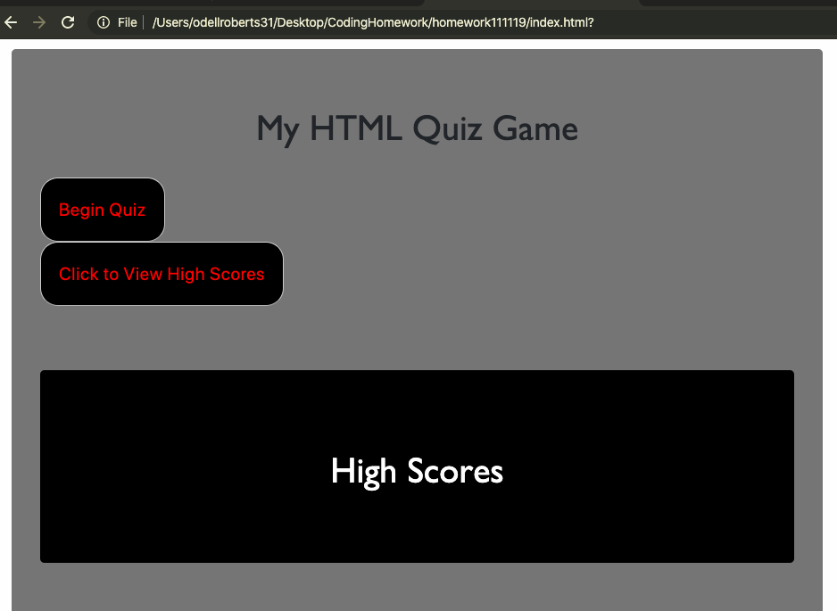

# homework111119

## My HTML Quiz

 In this homework I was tasked with creating a quiz that will give you a score, allow you to look at high scores and submit your score if it is the high score.

## Directions

 You will first select button to start quiz.

there will be a series of 5 questions pertaining to HTML.

You will have a total of 75 seconds to answer all 5 questions.

There is a bonus to your score if you csn answer all 5 questions in 25 seconds or less.

You will be prompted to submit your high score if you have it.

You will also be able to see the high score as well.

Below will be a screenshot of what the quiz will look like:

 

